# 订阅微博并同步至Telegram


## 实现了什么功能？
订阅某个博主的微博，如果博主有发新微博、编辑、转发微博等动态，则及时将微博最新动态发送到指定的Telegram频道，支持图片和视频备份到Telegram。

## 实现该功能的初衷
觉得有些博主的文章质量比较高，想要不错过这些博主的微博，又不是一直刷微博，把想看的微博推送到自己的消息渠道。本来之前有好几个小程序/公众号可以订阅微博，后面都不断关闭该功能，于是考虑用Telegram作为信息渠道。

**⚠️请注意：**
1. 微博博文中的表情包会被过替换为文字
2. `粉丝可见`、`好友可见`、`分组可见`、`仅自己可见`等`非公开微博`无法被获取到
3. 推送到Telegram的图片最大5MB，视频最大20MB，超过限制会被压缩


## 效果预览
👇推送到Telegram效果预览 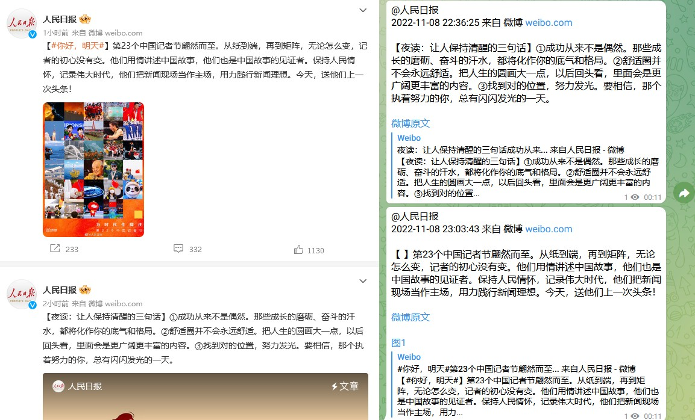

# <h1 id="quickstart">快速开始</h1>
**目录：**
* [1. 下载](#f1)
* [2. 配置](#f2)
* [3. 使用](#f3)

## <h2 id="f1">下载</h2>
```bash
git clone git@github.com:derotyoung/weibo-subscribe-public.git
cd weibo-subscribe-public
```

## <h2 id="f2">配置</h2>
1. 初始化数据库。需要MySQL数据库，新建一个`weibo_subscribe`数据库，执行[初始化脚本](src/main/resources/sql/weibo_subscribe_init.sql)
   * `user_subscribe` 微博用户配置表，参考阅读[如何获取微博数字ID](#b5)
   * `history_post` 微博推送记录表
2. 在表`user_subscribe`配置需要订阅的微博用户，可在运行过程中添加订阅，👇示例：<br>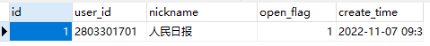<br>
   只说明必填字段，其他字段为非必填，含义见注释或者顾名思义即可<br>
   `user_id`    -- 微博用户ID<br>
   `open_flag`  -- 是否开启订阅(1=开启,0=关闭)，便于随时停止订阅
3. 修改配置文件[application.yml](src/main/resources/application.yml)，参考阅读[如何创建bot & 获取token](#b3) <br>

|必填| 配置项        |                                代表含义 |                       示例 |
|----| --------      |------------------------------------:|-------------------------:|
|✅| spring.database.url |                               数据库地址 |           localhost:3306 |
|✅| spring.database.username |                              数据库用户名 |                     root |
|✅| spring.database.password |                               数据库密码 |                   123456 |
|✅| weibo.subscribe.telegramChatId |               在Telegram申请的bot token | 886947303:AAFGhtD3s5KDJ… |
|✅| weibo.subscribe.telegramBotToken |                    在Telegram创建的频道ID |           -1003769903788 |
|×| weibo.subscribe.cyclePeriod | 定时执行周期，单位：秒，系统默认为30(要么注释此项，否则一定要填值) |                        3 |
|×| weibo.subscribe.proxy |   http代理，无法连接至Telegram服务器时配置，否则不要配置 |    http://127.0.0.1:7890 |

## <h2 id="f3">使用</h2>
   上述步骤完成后，使用IDEA(或其他IDE)启动SpringBoot项目，启动后默认每30秒执行一次查询。
   或者自行部署到服务器。


# <h1 id="reference">参考阅读</h1>
**目录：**
* [获取微博数字ID](#r1)
* [Telegram创建Bot & 获取token](#r2)
* [Telegram创建频道/群组 & 添加Bot](#r3)
* [获取Telegram频道数字ID](#r4)

## <h2 id="r1">获取微博用户ID</h2>
Web端在用户主页链接(https://weibo.com/u/2803301701)中能直接获取微博用户ID，如下。移动端同样在`用户主页` -> 右上角`···`-> `复制链接`，复制出的链接和Web端的格式一样
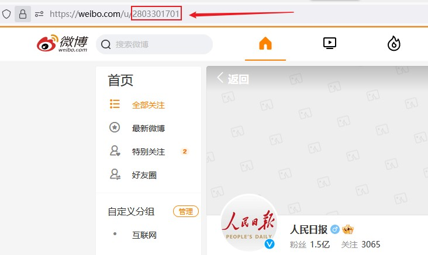

## <h2 id="r2">Telegram创建BOT & 获取token</h2>
🔔需要保证有国际网络环境<br>
1. 私聊`@BotFather` 发送`/newbot`创建一个Telegram Bot
2. 按照提示发送bot名字，名字中英文都可以
3. 输入bot的唯一id，只能是数字、字母、下划线为组合，必须以`bot`结尾，如`XZgakYDobot`、`bzONCofs_bot`都可以, 下述以`WeiboSyncBot`为例
4. 然后就可以获得到bot的token(示例：5458704928:AAHBqZFKpu4T8EEGAJFPDT4FNfGqwxoOlGs)

   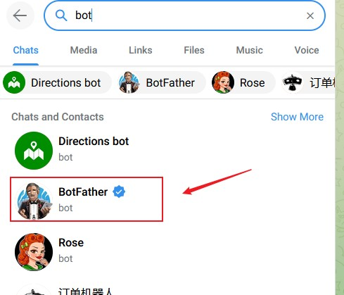
   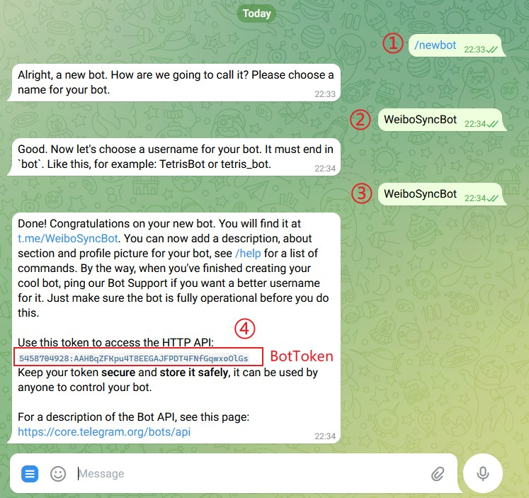

## <h2 id="r3">Telegram创建频道/群组 & 添加Bot</h2>
🔔需要保证有国际网络环境<br>
区别：频道类似公众号，只有管理员才可以发言；群组类似QQ群，所有加群人都可以一起发言；
选择自己喜欢的类型就可以，一般情况只是追星或者特意关注某个博主，建议选择创建频道；如果是一边关注博主动态，一边有和朋友们一起聊天，可以选择群组。
以 Telegram Web 端为例
1. 创建频道`new Channel`
   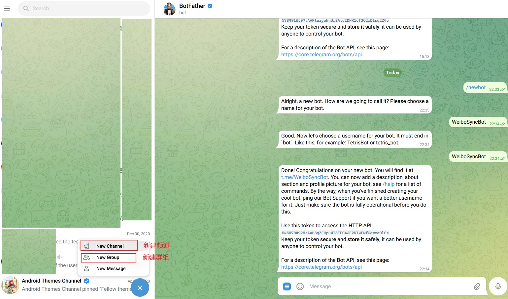
2. 搜索并添加刚刚创建的机器人进频道
   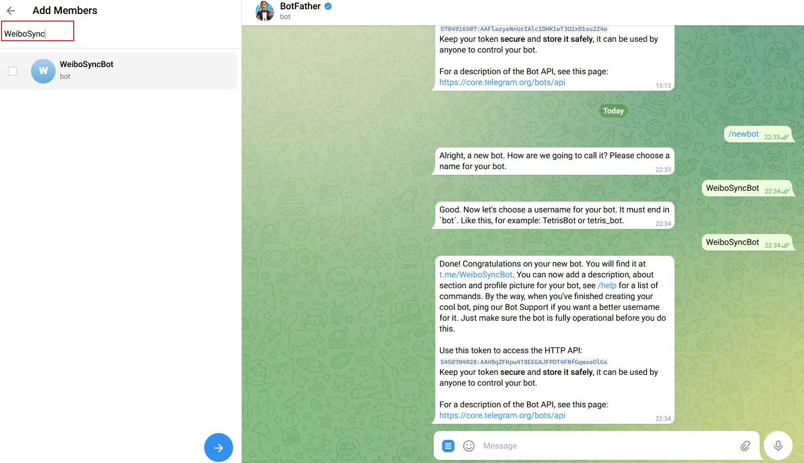
3. 设置频道头像以及名字`Channel name`，可以为中文，设置频道描述`Description(optional)`可以为空
   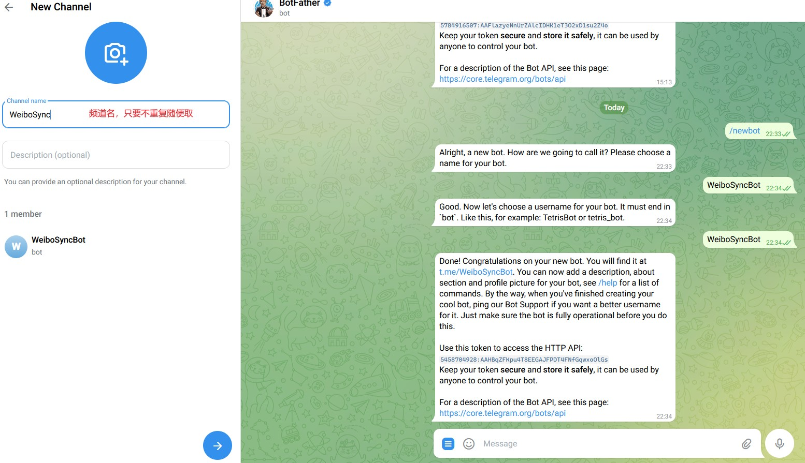
4. 设置频道类型，是公开`Public Channel`还是私密`Private Channel`，公开频道可以自定义链接，任何人都可以加入；私密频道无法自定义链接，只能通过生成的连接邀请加入
5. 创建最后一步，把Bot添加进频道(第2步无效)并设置为管理员
   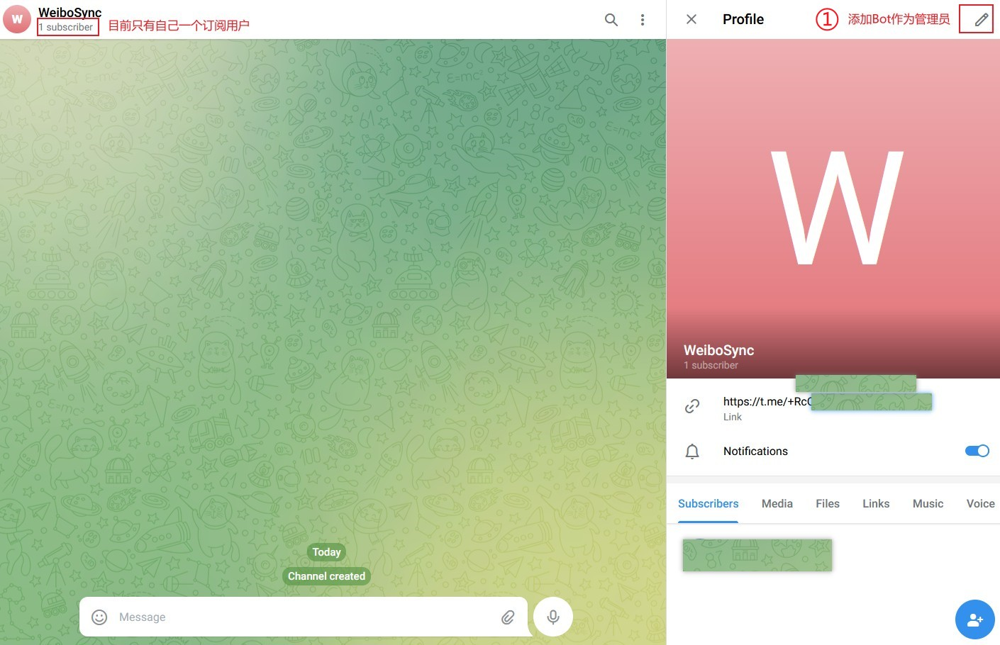
   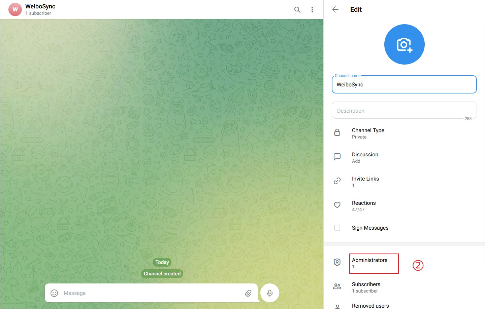
   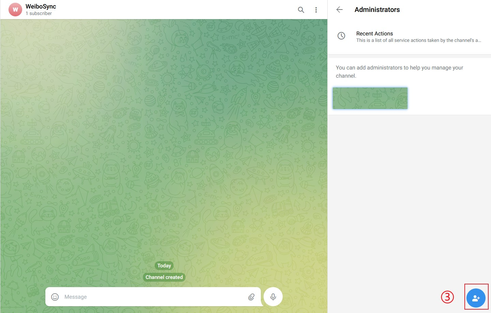
   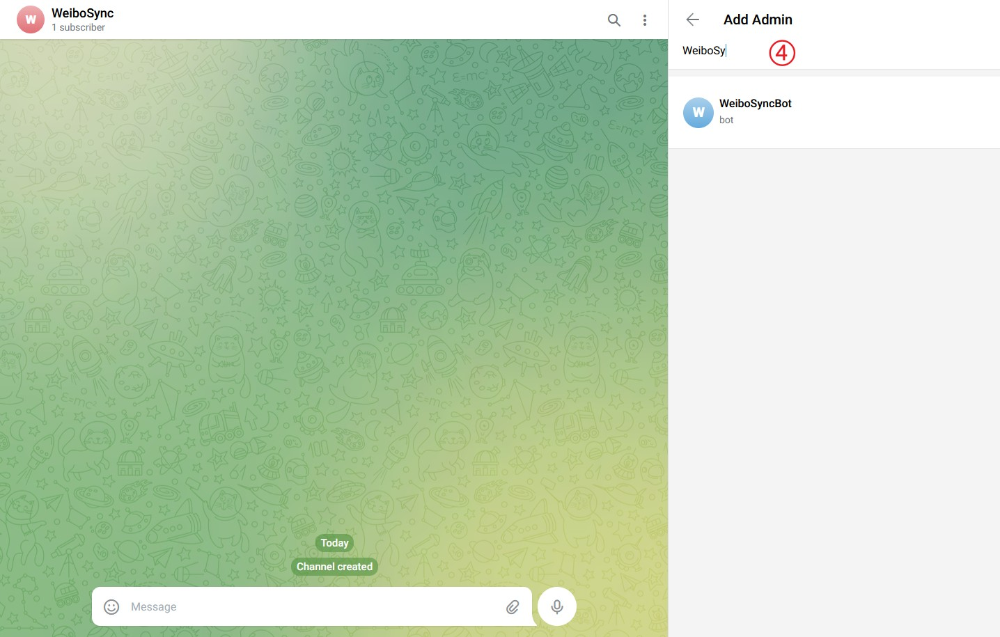
   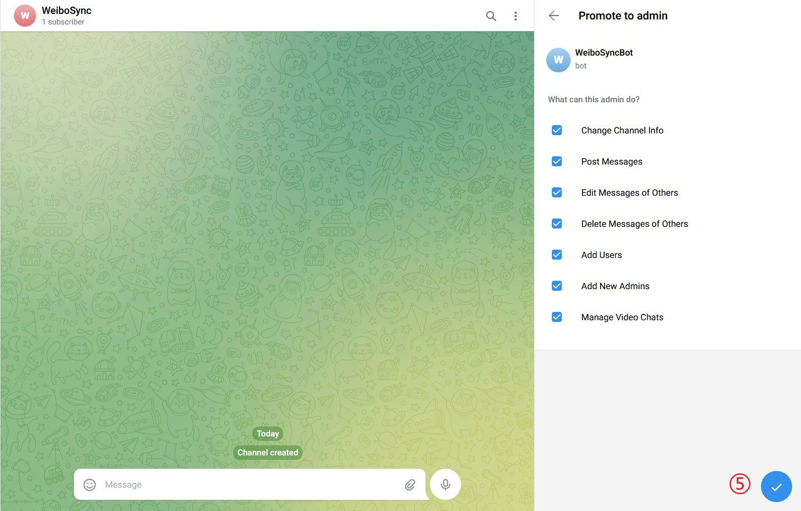
   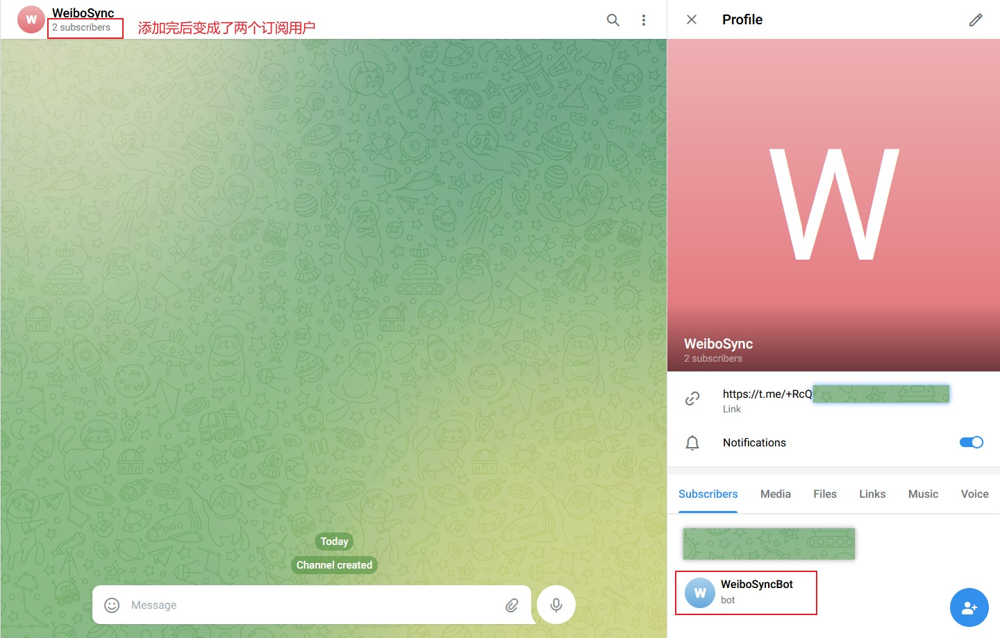

## <h2 id="b6">6. 获取Telegram频道ID</h2>
🔔需要保证有国际网络环境<br>
1. 取[Telegram创建Bot & 获取token](#r2)中获取的token，访问`https://api.telegram.org/bot+刚才创建bot时申请的token+/getupdates`,直接在浏览器地址栏打开即可,如下
2. 访问`https://api.telegram.org/bot+刚才创建bot时申请的token+/getupdates`, 直接在浏览器地址栏打开即可
   ```bash
    https://api.telegram.org/bot5458704928:AAHBqZFKpu4T8EEGAJFPDT4FNfGqwxoOlGs/getupdates
   ```
   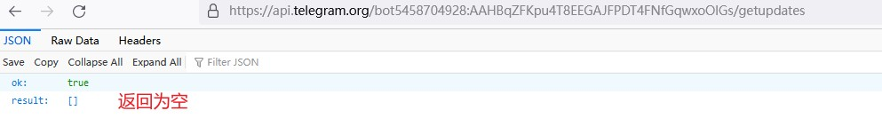 
3. 如发现返回结果为空，先把Bot移出频道再重新添加进频道为管理员，再进行步骤2即可，如下。在访问结果里找到```"chat":{"id":-1001385856968, "title":……}```，其中的`-1001885177644`就是频道ID
   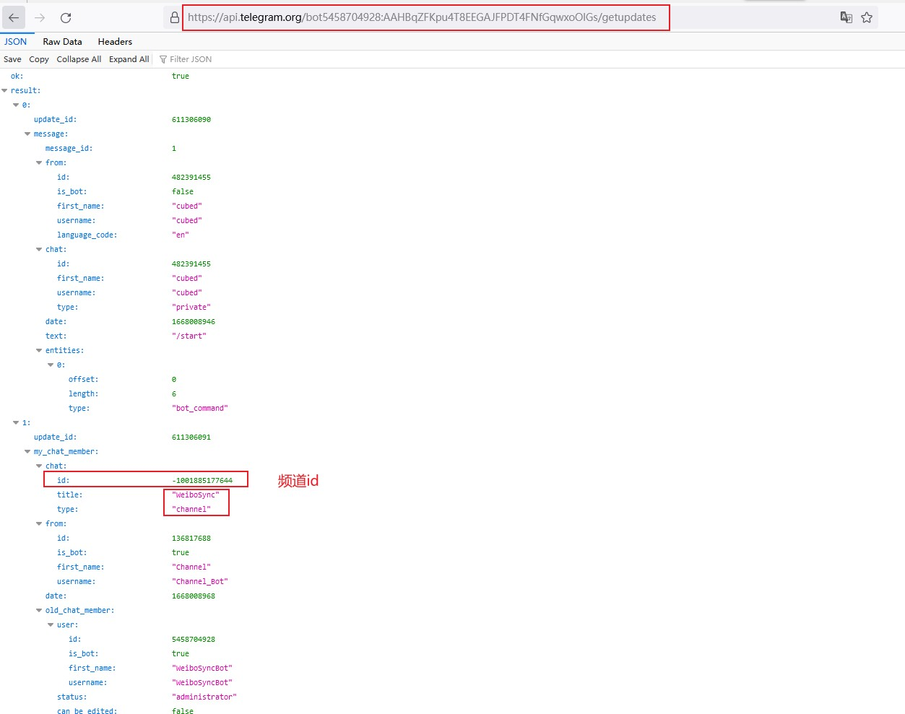 

